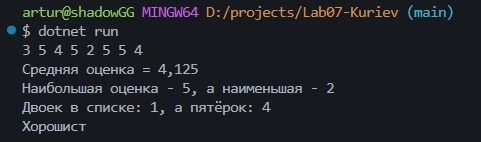
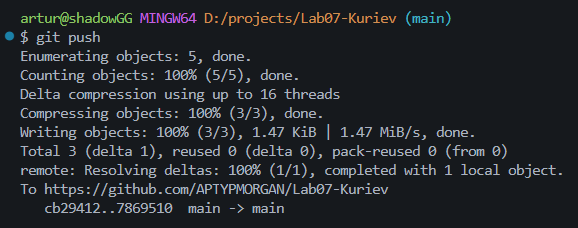

# Практическая работа №7

**ФИО: Куриев Артур Майрбекович**

**Группа: ИСП-241**

**Дата: 09.10.2026**

## Что изучено

* Изучено как работать с массивами
* Изучено как узнать длину массива с помощью .Length
* Изучено как перебирать элементы в массивах
* Изучено как создавать обычные массивы и пустые массивы нужного размера
* Изучено как получать информацию о конкретном элементы массива с помощью индексов

